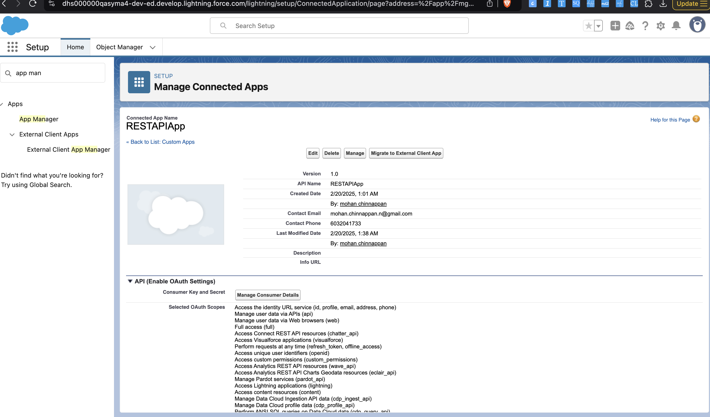
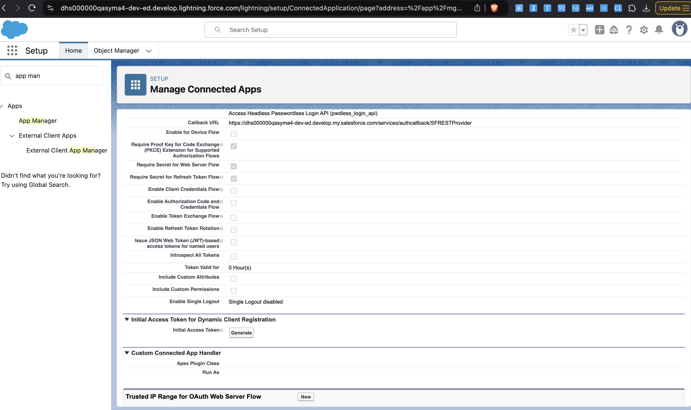
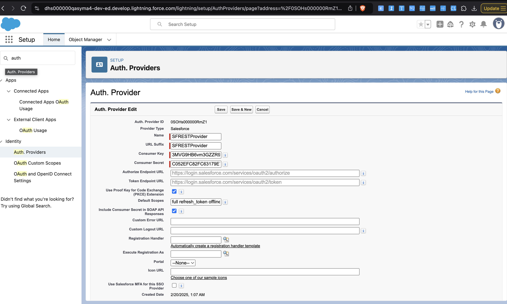
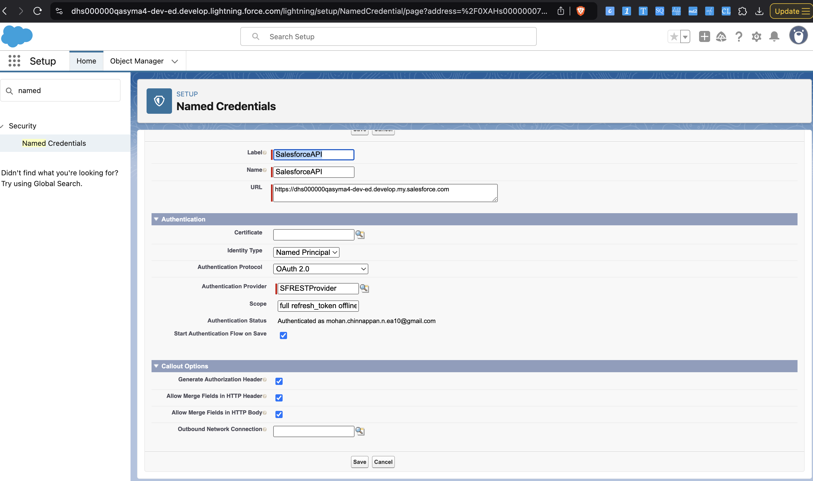

# REST & Query Data Viewer (LWC Component)

## Code
- [LWC Code](https://github.com/mohan-chinnappan-n5/lwr-components/tree/main/force-app/main/default/lwc/resty)
- [Apex Code](https://github.com/mohan-chinnappan-n5/lwr-components/blob/main/force-app/main/default/classes/RestResourceController.cls)

## Overview

This Lightning Web Component (LWC) provides a UI to interact with Salesforce REST API and SOQL Query API, allowing users to fetch, view, and search data dynamically. It includes:
-	REST API Request Execution
-	SOQL Query Execution
-	Tooling API Support
-	Dynamic Data Table with Pagination, Sorting, and Search
-	Floating Balloon for API Responses
-   CSV download for the datatable component

## Demo
- 
## Features

✅ 1. REST API Integration
	•	Fetches data from a user-specified REST endpoint.
	•	Supports both Standard and Tooling API via a checkbox.
	•	Displays JSON response in a formatted UI.

✅ 2. SOQL Query Execution
	•	Allows users to enter and run SOQL queries.
	•	Supports Tooling API for querying metadata.
	•	Displays query results in a sortable, searchable, paginated table.

✅ 3. Dynamic Data Table
	•	Sorting: Click on column headers to sort data.
	•	Pagination: Users can select page size (5, 10, 20 records per page).
	•	Search Box: Quickly find records.
	•	Automatic Column Type Detection: Text, Number, Boolean, Date.

✅ 4. Floating Response Balloon
	•	Shows API responses when no records are found.

## Component UI

### Usage

🛠 How to Use This Component?
-	REST API Mode
	    -	Enter a Salesforce REST API URL.
	    -	Select Tooling API (optional).
	    -	Click Fetch Data.
-	SOQL Query Mode
	-	Enter a SOQL Query in the TextArea.
	-	Select Tooling API (optional).
	-	Click Run Query.
-	View Data in Table
	-	Use Pagination Controls to navigate pages.
	-	Use Sorting by clicking on column headers.
	-	Use Search to filter records.
    -   Export CSV

## Setup required
- 
- 
- 
- 

## Reference
- [Using Named Credentials for calling REST from Apex
](https://github.com/forcedotcom/b2b-commerce-on-lightning-quickstart/blob/master/examples/lwc/docs/NamedCredentials.md)